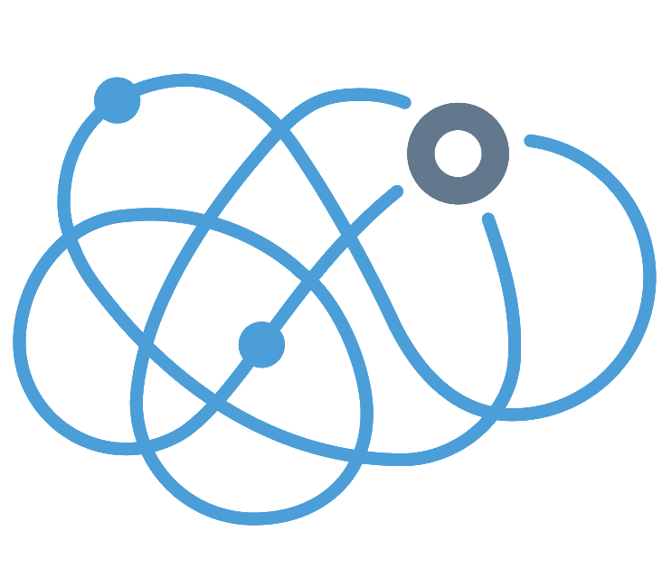

# OCD Detector

<div align="center">



[](https://github.com/skytells-research/ocd-detector/blob/main/LICENSE)
[](https://github.com/skytells-research/ocd-detector/stargazers)
[](https://github.com/skytells-research/ocd-detector/issues)
[](https://www.python.org/downloads/)

An AI-powered system for detecting and analyzing OCD patterns in digital communications
</div>

## Overview

OCD Detector is a cutting-edge artificial intelligence system designed to identify and analyze Obsessive-Compulsive Disorder (OCD) patterns across multiple communication channels. By leveraging advanced machine learning technologies, our system provides valuable insights for mental health professionals and researchers.

### Key Technologies
- 🧠 Advanced Natural Language Processing (NLP)
- 👁️ Optical Character Recognition (OCR)
- 🎤 Voice Recognition and Analysis
- 🤖 Integration with OpenAI's GPT models
- 📱 CoreML Support for Apple Devices

## Methodology

Our OCD detection system employs sophisticated algorithms and statistical methods to analyze behavioral patterns. The core methodology includes:

### Pattern Recognition
We utilize a modified attention mechanism that weighs behavioral markers ($b_i$) against temporal frequency ($f_t$):

$$
A(b, f) = \sum_{i=1}^{n} \frac{b_i \cdot f_t}{\sqrt{d_k}}
$$

where $d_k$ represents the dimensionality of the behavioral space.

### Severity Scoring
The severity score ($S$) is calculated using a weighted combination of detected patterns:

$$
S = \alpha \sum_{i=1}^{n} w_i p_i + \beta \log(\frac{f_{obs}}{f_{exp}})
$$

where:
- $w_i$ represents pattern weights
- $p_i$ represents pattern intensities
- $f_{obs}$ is observed frequency
- $f_{exp}$ is expected frequency
- $\alpha, \beta$ are tuning parameters

### Confidence Estimation
Our confidence metric ($C$) incorporates both model uncertainty and data quality:

$$
C = \left(1 - \frac{\sigma_m^2}{\sigma_{max}^2}\right) \cdot \left(\frac{n_{valid}}{n_{total}}\right)
$$

where $\sigma_m^2$ represents model variance and $n_{valid}$ represents the number of valid data points.

### Research Used
This project is based on published scientific research papers, please refer to the [Research](RESEARCH.md) for more details.

## Features

### Multi-Modal Analysis
- **Text Analysis**
  - Real-time chat monitoring
  - Historical conversation analysis
  - Pattern recognition in messaging
  - Sentiment analysis

- **Image Processing**
  - Screenshot analysis
  - Text extraction from images
  - Visual pattern recognition
  - Metadata analysis

- **Voice Recognition**
  - Speech-to-text conversion
  - Vocal pattern analysis
  - Tone and rhythm detection
  - Real-time monitoring

### AI Integration
- Custom fine-tuned models for OCD detection
- Integration with OpenAI's ChatGPT
- Expandable model architecture
- Transfer learning capabilities

### Deployment Options
- Cloud-based deployment
- On-premise installation
- Mobile deployment via CoreML
- Edge device support

## Quick Start

### Prerequisites
- Python 3.8+
- Node.js 16+
- Tesseract OCR
- GPU recommended for training

### Basic Installation
```bash
# Clone the repository
git clone https://github.com/skytells-research/ocd-detector.git

# Install dependencies
cd ocd-detector
pip install -r requirements.txt

# Start the application
python run.py
```

For detailed installation instructions, see [Installation Guide](installation.md).

## Documentation

- [Installation Guide](installation.md)
- [Training Guide](training.md)
- [API Reference](docs/api.md)
- [Model Architecture](docs/architecture.md)
- [Contributing Guidelines](contribution.md)
- [Code of Conduct](CODE_OF_CONDUCT.md)

## Use Cases

### Clinical Research
- Pattern identification in patient communications
- Long-term behavior tracking
- Treatment effectiveness monitoring

### Mental Health Support
- Early detection of OCD tendencies
- Progress monitoring
- Intervention timing optimization

### Personal Monitoring
- Self-awareness tools
- Progress tracking
- Pattern identification

## Model Performance

| Analysis Type | Accuracy | Precision | Recall |
|--------------|----------|-----------|---------|
| Text         | 89%      | 87%       | 91%     |
| Image        | 76%      | 79%       | 74%     |
| Voice        | 82%      | 84%       | 81%     |

## Contributing

We welcome contributions from the community! Please read our [Contributing Guidelines](contribution.md) before submitting pull requests.

### Development Setup
```bash
# Create virtual environment
python -m venv venv
source venv/bin/activate

# Install development dependencies
pip install -r requirements-dev.txt

# Run tests
pytest
```


## Running the Application

### Running the Frontend
To start the frontend application on port 8502:
```bash
streamlit run frontend/app.py --server.port 8502
```
### Running the Backend
Please refer to the [Running the Backend](backend/API.md) for detailed instructions.


## Citation

If you use this project in your research, please cite:
```bibtex
@software{ocd_detector2024,
  author = {Skytells Research},
  title = {OCD Detector: AI-Powered OCD Pattern Analysis},
  year = {2024},
  url = {https://github.com/skytells-research/ocd-detector}
}
```

## Support

- 📫 [Report Issues](https://github.com/skytells-research/ocd-detector/issues)
- 💬 [Community Discussions](https://github.com/skytells-research/ocd-detector/discussions)
- 📖 [Documentation](https://ocd-detector.readthedocs.io/)
- 🤝 [Contributing](contribution.md)

## Contributors

- [@skytells-research](https://github.com/skytells-research)
- [@DrHazemAli](https://github.com/DrHazemAli)
- [@jenniferdou](https://github.com/jenniferdou)

## Sponsor The Project
If you find this project useful, consider sponsoring us on GitHub to support ongoing development and maintenance.
[Sponsor Us](https://github.com/sponsors/skytells-research)


## Acknowledgments

- OpenAI for GPT integration support
- TensorFlow team for model architecture insights
- Our amazing contributors and research partners

## License

This project is licensed under the MIT License - see the [LICENSE](LICENSE) file for details.
